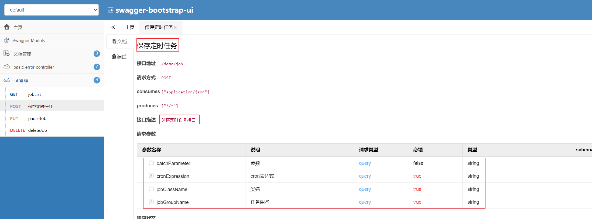

## 1、添加pom

```java
<!--swagger需要引入的依赖-->
<dependency>
  <groupId>io.springfox</groupId>
  <artifactId>springfox-swagger2</artifactId>
  <version>2.9.2</version>
</dependency>
<dependency>
  <groupId>io.springfox</groupId>
  <artifactId>springfox-swagger-ui</artifactId>
  <version>2.9.2</version>
</dependency>
<!--集成swagger-bootstrap-ui-->
<dependency>
  <groupId>com.github.xiaoymin</groupId>
  <artifactId>swagger-bootstrap-ui</artifactId>
  <version>1.8.7</version>
</dependency>java
```

## 2、配置文件

```java
@Configuration
@EnableSwagger2
@EnableSwaggerBootstrapUI // 开启SwaggerBootstrapUI
public class SwaggerConfig {
  @Bean
  public Docket api() {
    return new Docket(DocumentationType.SWAGGER_2)
      .apiInfo(apiInfo())
      .select()
      .apis(RequestHandlerSelectors.any())
      .paths(PathSelectors.any())
      .build();
  }

  private ApiInfo apiInfo() {
    return new ApiInfoBuilder()
      .title("定时任务DEMO") //  可以用来自定义API的主标题
      .description("定时任务DEMO及相关页面配置") // 可以用来描述整体的API
      .termsOfServiceUrl("") // 用于定义服务的域名
      .version("1.0") // 可以用来定义版本。
      .build(); //
  }
}

```

3、controller加配置

```java
@Api(tags = "job管理")//类名注解
@ApiOperation(value = "保存定时任务", notes = "保存定时任务接口")//方法注解
```
model配置
```java
@ApiModel(description = "定时任务详情")//类名注解
@ApiModelProperty(value = "类名", required = true, notes="类名notes")//方法注解
```
使用效果

## 4、访问地址
http://localhost:8080/demo/swagger-ui.html

http://localhost:8080/demo/doc.html

